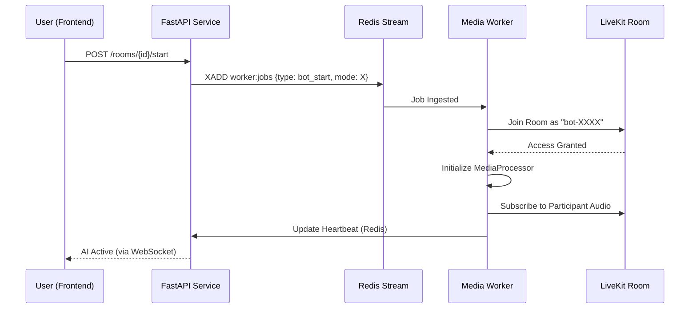
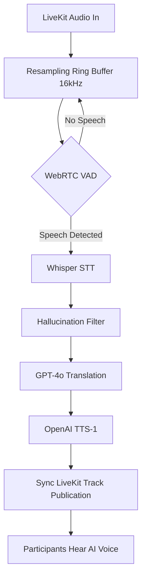
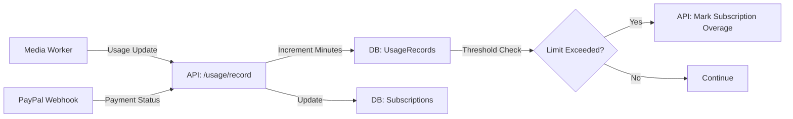

#  AYTME: Real-Time AI Platform Specification

## 1. Executive Summary
AYTME is an enterprise-grade, real-time conferencing and interpretation platform. It leverages a three-tier architecture to bridge standard WebRTC communication with an event-driven AI media pipeline, providing low-latency translation and transcription across three distinct use cases: multi-user conferences, single-device physical sessions, and one-to-many broadcasts.

---

## 2. Technology Stack
The platform uses a modern, high-performance stack optimized for real-time media and high-concurrency state management.

### **Backend (The Core)**
*   **Framework**: FastAPI (Python 3.11)
*   **Database**: PostgreSQL / SQLAlchemy 2.0 (Async)
*   **State & Queuing**: Redis / Redis Streams
*   **WebRTC Engine**: LiveKit (SDK/API)

### **AI Pipeline**
*   **STT (Speech-to-Text)**: OpenAI Whisper-1
*   **LLM (Translation)**: OpenAI GPT-4o
*   **TTS (Text-to-Speech)**: OpenAI TTS-1

### **Frontend (The Clients)**
*   **Web**: React 18 + Vite, Zustand, TailwindCSS, Framer Motion
*   **Mobile**: React Native

---

## iOS/macOS Safari Configuration Checklist
For reliable audio capture/playback and translation across Conversation, Talk Together, and Broadcast modes:

1. Serve frontend over HTTPS (required by Safari for microphone/WebRTC).
2. Ensure LiveKit endpoint is WSS (`LIVEKIT_URL=wss://...`).
3. Configure frontend origin and CORS with exact HTTPS domains (`FRONTEND_URL`, `CORS_ORIGINS`).
4. Keep permission policy allowing required features for same-origin app pages:
    `autoplay`, `microphone`, `camera`, `fullscreen`, `clipboard-write`.
5. Use Safari-compatible build target (`es2018` + Safari CSS target).
6. Use long proxy timeouts for `/api` requests to prevent premature stream interruption on mobile networks.

---

## 3. Functionality & Scope of Work

### **A. Core Features**
*   **Multi-Tenancy**: Organization-based isolation with RBAC.
*   **Room Management**: Private/Public rooms with unique slugs.
*   **Lobby & Guest Access**: Slug-based lobby for unauthorized users.
*   **Billing & Subscriptions**: PayPal integration with overage tracking.

### **B. Operating Modes**
1.  **Conversation Mode**: Multi-user interpretation.
2.  **Talk Together Mode**: Physical session single-device proxy.
3.  **Broadcast Mode**: One-to-many with dynamic language demand.

---

## 4. Technical Workflows

### **Flow A: The AI Activation Workflow**


**Text-Based Flow Map:**
```text
[User] -> (API: /start) -> [Redis Queue] -> [Media Worker] 
                               |                |
                               V                V
                        [LiveKit Room] <--- [AI Bot Joins]
```

### **Flow B: The Translation Cascade (Real-Time)**


**Text-Based Flow Map:**
```text
(Audio In) -> [VAD Filter] -> [Whisper STT] -> [GPT Translation] -> [TTS Tone] -> (Audio Out)
```

---

## 5. Database Architecture & Data Flow

### **Schema & Entity Relationships**
The database consists of 15+ specialized tables:
*   **users**: Identity and authentication.
*   **organizations**: Primary billing and resource container.
*   **org_members**: RBAC mappings.
*   **rooms**: Configuration and active session state.
*   **transcripts**: Historical interpretative logs.
*   **tts_artifacts**: Cached AI audio segments.
*   **subscriptions**: PayPal lifecycle mapping.
*   **usage_records**: Metered interpretation minutes.
*   **billing_events**: Invoicing and payment history.
*   **worker_assignments**: Infrastructure state mapping.

### **The Billing Data Flow**


---

## 6. Operational Maintenance
*   **CI/CD**: GitLab Pipeline -> Docker -> DigitalOcean App Platform.
*   **Monitoring**: `[VITAL]` logs for tracing latency.
*   **Deployment**: Spec managed via `digitalocean-spec.yaml`.
